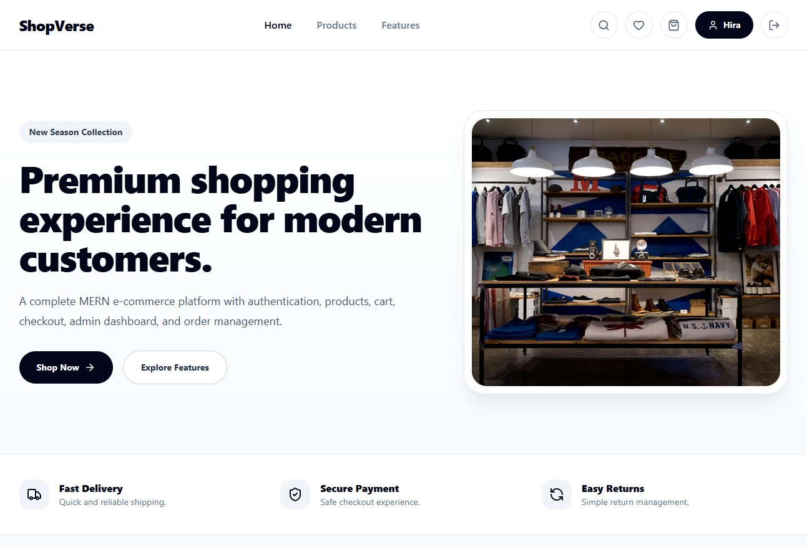
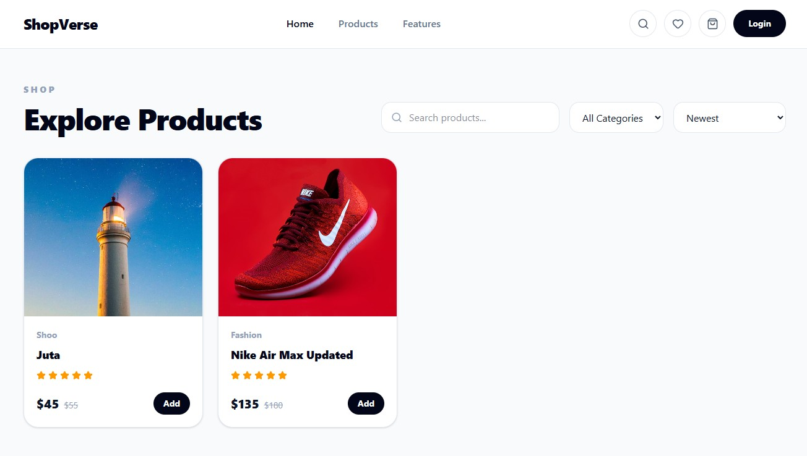
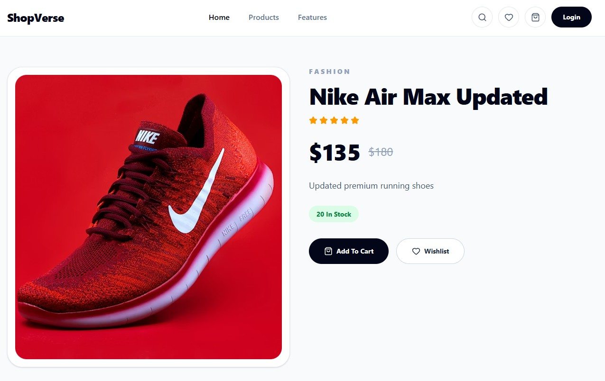
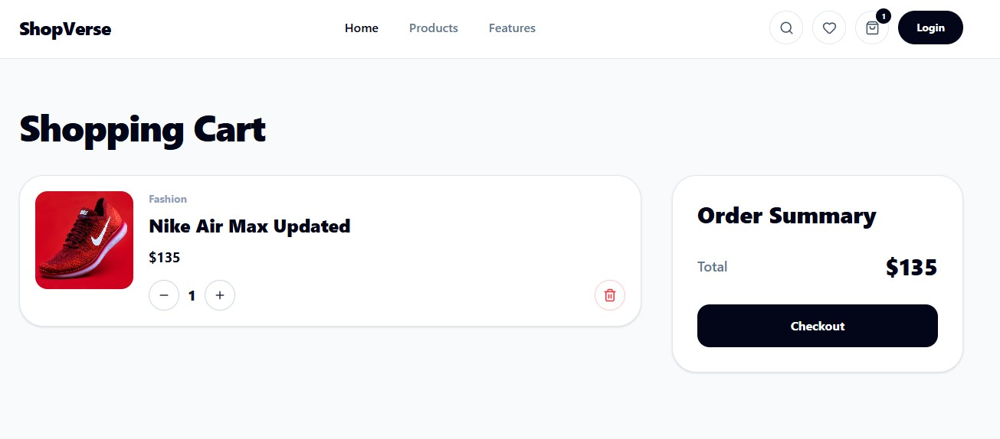
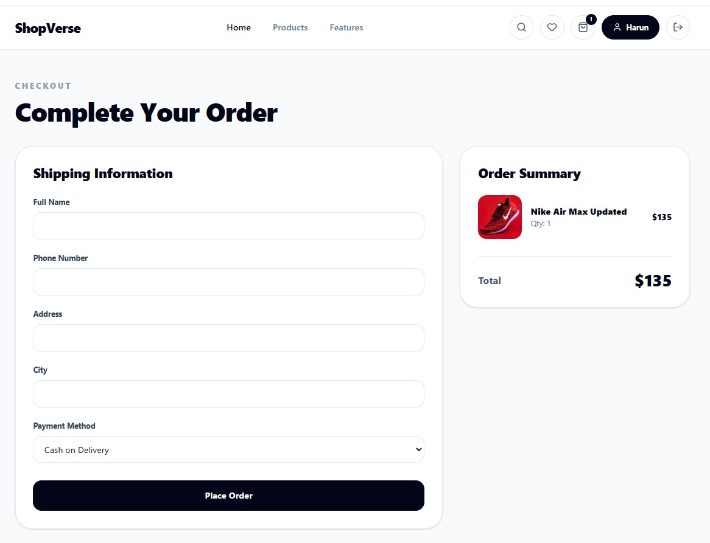
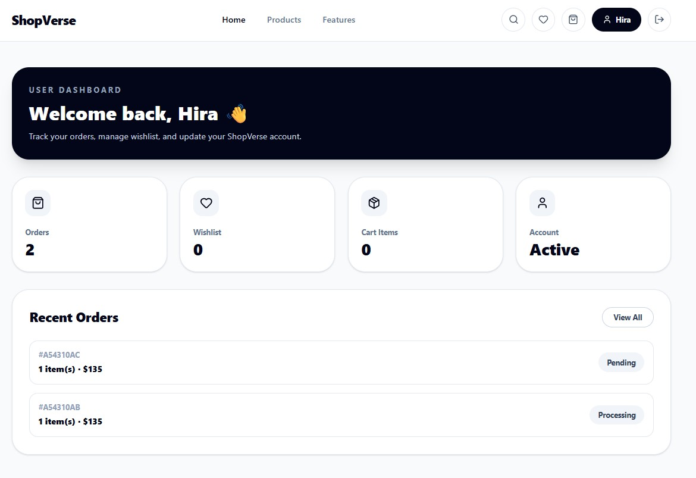
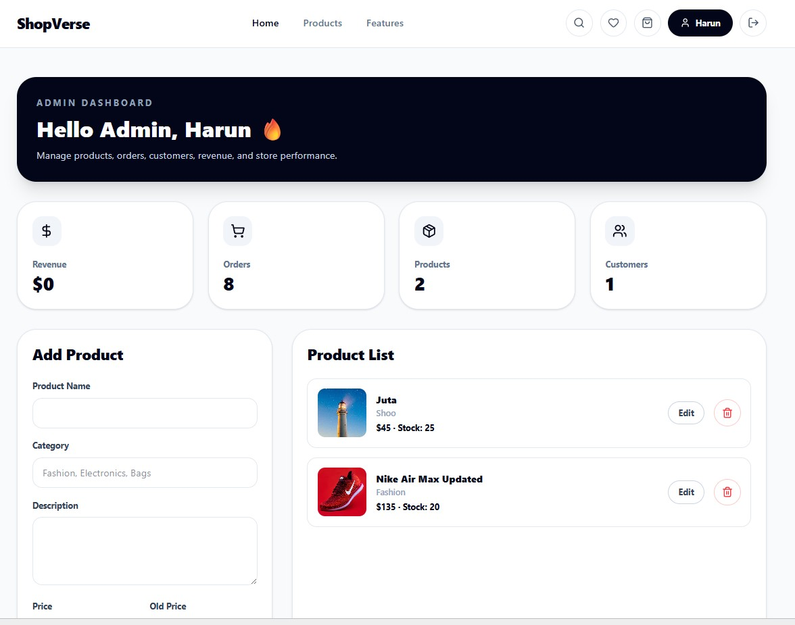
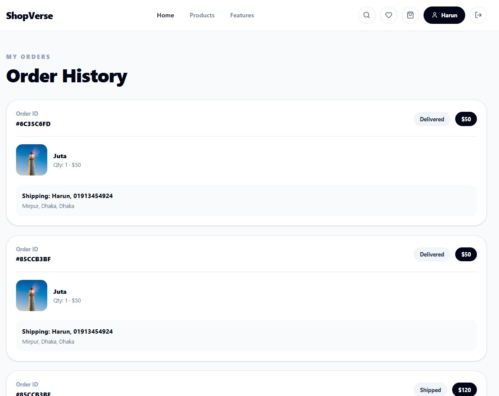

# 🛍️ ShopVerse Client

Modern MERN Stack E-commerce frontend built with React, Vite, Tailwind CSS, Context API, and JWT authentication.

## 🌐 Live Demo

Frontend: https://shopverse-client-silk.vercel.app  
Backend API: https://shopverse-server-sigma.vercel.app

---

# ✨ Features

- 🔐 Authentication (Login/Register)
- 🛒 Add to Cart System
- ❤️ Wishlist UI
- 📦 Checkout & Order Placement
- 👤 User Dashboard
- 🛠️ Admin Dashboard
- ➕ Add/Edit/Delete Products
- 📊 Order Management
- 🔎 Product Search & Filtering
- 📱 Fully Responsive UI
- ⚡ Fast Vite Setup

---

# 🧰 Tech Stack

## Frontend

- React.js
- Vite
- Tailwind CSS
- React Router DOM
- Axios
- Context API
- React Hot Toast
- Lucide React Icons

---

# 📂 Folder Structure

```bash
src/
 ├── components/
 ├── context/
 ├── pages/
 ├── services/
 ├── routes/
 └── assets/
```

---

# ⚙️ Installation

```bash
git clone https://github.com/Tsharun25/shopverse-client.git
cd shopverse-client
npm install
npm run dev
```

---

# 🔑 Environment Variables

Create `.env` file:

```env
VITE_API_URL=http://localhost:5000/api
```

---

# 👨‍💻 Demo Credentials

## Admin

```txt
Email: admin@gmail.com
Password: 123456
```

## User

```txt
Email: harun@gmail.com
Password: 123456
```

---

# 🚀 Future Improvements

- Stripe Payment Gateway
- Wishlist Backend
- Product Reviews
- Order Tracking
- Dark Mode
- Image Upload System

---

# 📸 Screenshots


### Home Page


### Products


### Product Details


### Cart


### Checkout


### User Dashboard


### Admin dashboard


### Orders page

---

# 👨‍💻 Developer

Harun Ar Rashid

- GitHub: https://github.com/Tsharun25